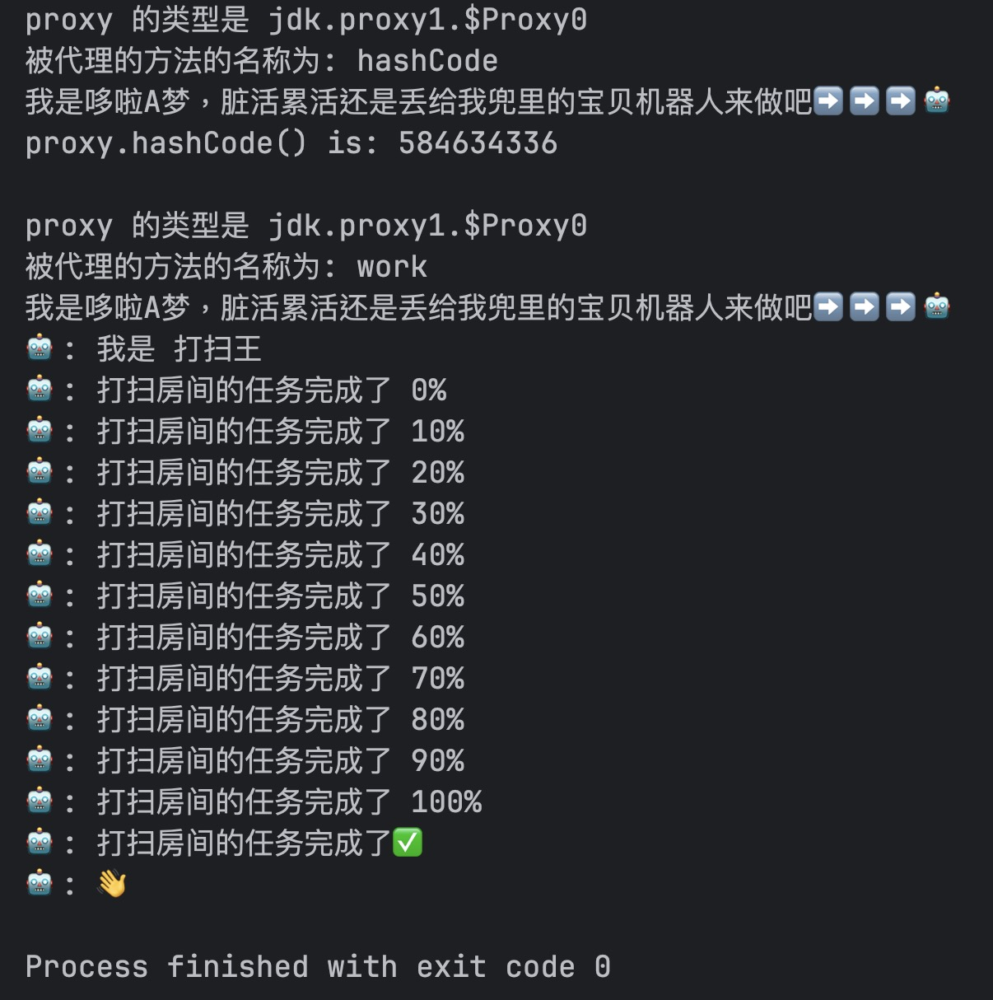
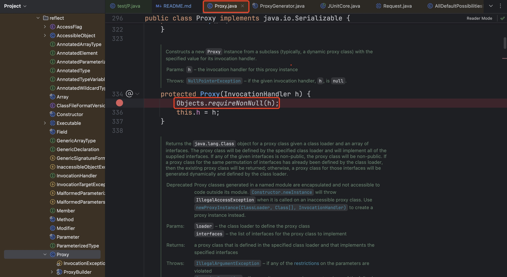
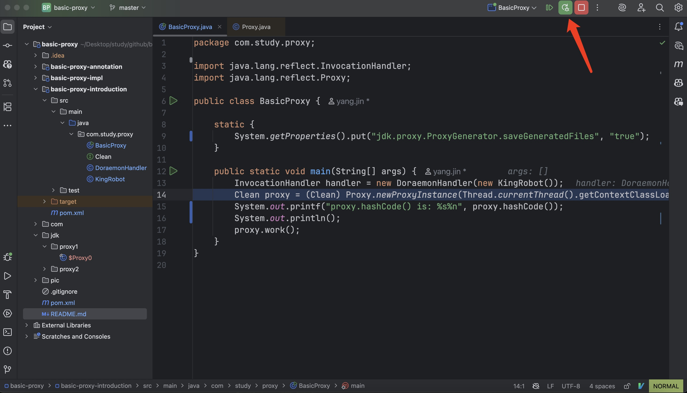
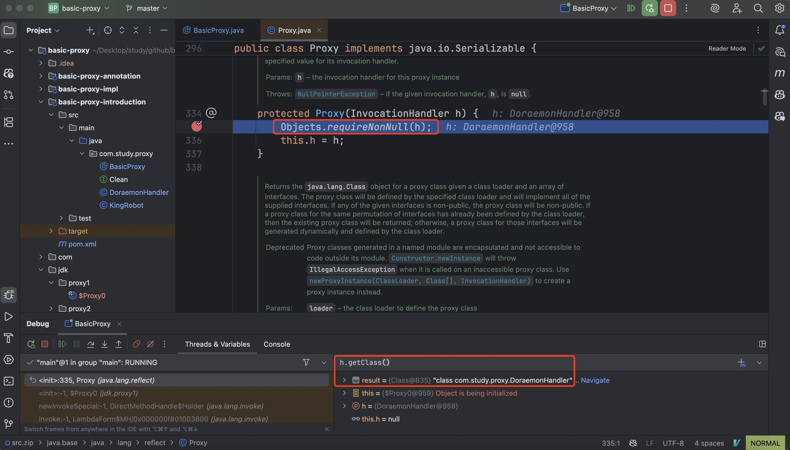

# basic-proxy
学习 `InvocationHandler` 方式的动态代理

# 参考文章

1. [(豆瓣链接) Java 核心技术(卷I)](https://book.douban.com/subject/26880667/) 中的 6.5 小节
2. [(github) JavaSE6Tutorial 第 16 章 反射（Reflection） ](https://github.com/JustinSDK/JavaSE6Tutorial/blob/master/docs/CH16.md) 中的 16.2.5 小节(*Proxy 類別*)
3. [(掘金) 动态代理 Proxy 源码分析](https://juejin.im/entry/5a4af4116fb9a045104ad95b)
4. [(stackoverflow) How to create a directory in Java?](https://stackoverflow.com/questions/3634853/how-to-create-a-directory-in-java)
5. [(简书) JDK动态代理](https://www.jianshu.com/p/1a76e516aa53)
6. [(ImportNew) Java Proxy 和 CGLIB 动态代理原理](http://www.importnew.com/27772.html)
7. [(oracle 文档) Class Proxy](https://docs.oracle.com/javase/7/docs/api/java/lang/reflect/Proxy.html)


# 正文

动态代理涉及以下三个对象
1. 代理对象(称为`p`，意为 `proxy`) 
2. 处理器对象(称为`h`，意为 `handler`) 
3. 真正干活的对象(称为`r`，意为 `robot`，也就是下文会提到的名为 **打扫王** 的机器人)

我自己想了个例子，不知道算不算贴切。
**大雄的妈妈** 让 **大雄** 打扫房间，
**大雄** 不想做，于是把 **哆啦A梦** 找来，让其打扫，
**哆啦A梦** 从口袋里拿出了一个宝贝，名叫 **打扫王**，
最后 **打扫王** 把房间打扫好了。

在这个例子里，**大雄** 是代理对象 `p`,
**哆啦A梦** 是处理器对象 `h`，
**打扫王** 是真正干活的对象 `r`

当我们调用 `p` 上的一个方法时(**大雄的妈妈** 让 **大雄** 打扫房间)，
`p` 会去调用 `h` 中的名为 `invoke` 的方法(**大雄** 让 **哆啦A梦** 想办法并落实)，
而在这个 `invoke` 方法里，`r` 中的相应方法会被调用(**打扫王** 干活)。


## 用到的代码
我们可以建立 [一个小项目](https://github.com/fanofxiaofeng/basic-proxy) 来粗略地模拟上述例子。
该项目中的 [basic-proxy-introduction](https://github.com/fanofxiaofeng/basic-proxy/basic-proxy-introduction) 模块与本文有关。


红框中的5个文件内容如下

### [`pom.xml`](basic-proxy-introduction/pom.xml)
```xml
<?xml version="1.0" encoding="UTF-8"?>
<project xmlns="http://maven.apache.org/POM/4.0.0"
         xmlns:xsi="http://www.w3.org/2001/XMLSchema-instance"
         xsi:schemaLocation="http://maven.apache.org/POM/4.0.0 http://maven.apache.org/xsd/maven-4.0.0.xsd">
    <modelVersion>4.0.0</modelVersion>

    <groupId>com.study</groupId>
    <artifactId>basic-proxy-introduction</artifactId>
    <version>1.0-SNAPSHOT</version>
    <packaging>jar</packaging>

    <parent>
        <groupId>com.study</groupId>
        <artifactId>basic-proxy</artifactId>
        <version>1.0-SNAPSHOT</version>
    </parent>

    <dependencies>
        <dependency>
            <groupId>junit</groupId>
            <artifactId>junit</artifactId>
            <scope>test</scope>
            <version>4.13.1</version>
        </dependency>
    </dependencies>

    <build>
        <!-- 可以参考 https://maven.apache.org/shared/maven-archiver/examples/classpath.html -->
        <finalName>basic-study-introduction</finalName>
        <plugins>
            <plugin>
                <groupId>org.apache.maven.plugins</groupId>
                <artifactId>maven-jar-plugin</artifactId>
                <version>2.4</version>
                <configuration>
                    <archive>
                        <manifest>
                            <addClasspath>true</addClasspath>
                            <mainClass>com.study.proxy.BasicProxy</mainClass>
                        </manifest>
                    </archive>
                </configuration>
            </plugin>
        </plugins>
    </build>
</project>
```

### [`Clean.java`](basic-proxy-introduction/src/main/java/com/study/proxy/Clean.java)
其中定义了 `Clean` 接口

```java
package com.study.proxy;

/**
 * 打扫接口
 */
public interface Clean {
    void work();
}
```

### [`KingRobot.java`](basic-proxy-introduction/src/main/java/com/study/proxy/KingRobot.java)
**打扫王** 实现了 `Clean` 接口

```java
package com.study.proxy;

public class KingRobot implements Clean {

    public void work() {
        System.out.println("== ROBOT TIME BEGIN ==");
        System.out.println("我是 打扫王");
        for (int i = 0; i <= 100; i += 10) {
            System.out.println(String.format("打扫房间的任务完成了 %s%%", i));
        }
        System.out.println("打扫王 的任务完成了");
        System.out.println("== ROBOT TIME END ==");
    }
}
```

### [`DoraemonHandler.java`](basic-proxy-introduction/src/main/java/com/study/proxy/DoraemonHandler.java)
**哆啦A梦** 充当处理器(handler)
```java
package com.study.proxy;

import java.lang.reflect.InvocationHandler;
import java.lang.reflect.Method;

public class DoraemonHandler implements InvocationHandler {

    /**
     * 干活的机器人(即 "打扫王")
     */
    private Object target;

    public DoraemonHandler(Object target) {
        this.target = target;
    }

    /**
     * @param proxy  代理对象, 即 大雄
     * @param method 描述略
     * @param args   描述略
     * @return 描述略
     * @throws Throwable 描述略
     */
    public Object invoke(Object proxy, Method method, Object[] args) throws Throwable {
        System.out.println("proxy 的类型是 " + proxy.getClass().getName());
        System.out.println("被代理的方法的名称为 " + method.getName());
        System.out.println("我是哆啦A梦，脏活累活还是丢给打扫王处理吧⤵");
        return method.invoke(target, args);
    }
}
```


### [`BasicProxy.java`](basic-proxy-introduction/src/main/java/com/study/proxy/BasicProxy.java) (下方展示的内容与最终版本有些差异)
```java
package com.study.proxy;

import java.lang.reflect.InvocationHandler;
import java.lang.reflect.Proxy;

public class BasicProxy {

    public static void main(String[] args) {
        InvocationHandler handler = new DoraemonHandler(new KingRobot());
        Clean proxy = (Clean) Proxy.newProxyuInstance(Thread.currentThread().getContextClassLoader(), new Class[]{Clean.class}, handler);
        System.ot.println(String.format("代理者的类型为 %s", proxy.getClass().getName()));
        proxy.work();
    }
}
```

## 通过 `newProxyInstance()` 方法来产生代理类对象
### 相关代码的简要解释
我们可以通过调用 `public static Object newProxyInstance(ClassLoader loader, Class<?>[] interfaces, InvocationHandler h)` 来动态地产生一个代理类对象 `p`，
`newProxyInstance()` 方法的 javadoc 描述如下
> Returns an instance of a proxy class for the specified interfaces that dispatches method invocations to the specified invocation handler.

`newProxyInstance()` 方法有3个入参。
1. 入参 `loader` 是类加载器。
可以通过如下代码来获得一个类加载器
```java
Thread.currentThread().getContextClassLoader()
```

2. 入参 `interfaces` 是一个数组。
通过它来描述我们希望代理类实现的接口。
本文以 `com.study.proxy.Clean` 这个接口为例进行演示

3. 入参 `h` 是一个处理器。
`InvocationHandler` 是一个接口，
处理器通过调用 `InvocationHandler` 中的 `public Object invoke(Object proxy, Method method, Object[] args)` 方法来完成代理过程。
在本例中，我们用 `DoraemonHandler` 类来实现 `InvocationHandler` 接口。
`DoraemonHandler` 类的构造函数中需要传入实际干活的对象 `r`(即 **打扫王** 的实例)。
对应的代码为
```java
InvocationHandler handler = new DoraemonHandler(new KingRobot());
```

三个入参我们都可以获取到了，那么现在就可以产生代理对象(即 **大雄**)了
```java
Clean proxy = (Clean) Proxy.newProxyInstance(Thread.currentThread().getContextClassLoader(), new Class[]{Clean.class}, handler);
```

由于代理对象 `p` 也实现了 `Clean` 接口，所以可以调用 `p` 的 `work()` 方法
```java
proxy.work();
```


### 运行结果
运行 `BasicProxy` 中的 `main()` 方法，效果如下图


如果希望直接通过命令行运行的话，可以在项目顶层目录执行如下命令

```bash
mvn clean package
cd basic-proxy-introduction/
java -jar target/basic-study-introduction.jar
```


### 简单的分析
1. 在 `BasicProxy` 的 `main()` 运行时，我们会将局部变量 `proxy` 的实际类型输出(局部变量 `proxy` 的静态类型为 `com.study.proxy.Clean`，实际类型为`com.sun.proxy.$Proxy0`)
2. 在 `DoraemonHandler` 的 `invoke()` 被调用时，会将入参 `proxy` 的实际类型输出(入参 `proxy` 的静态类型为 `java.lang.Object`，实际类型为`com.sun.proxy.$Proxy0`)

先提出三个问题
1. 不难看出 `1` 和 `2` 中的 `proxy` 的实际类型相同，那么它们是否就是同一个对象呢？(是的)
2. `proxy` 的实际类型为 `com.sun.proxy.$Proxy0`，这个类的结构如何，为何可以把对 `proxy` 的一些方法调用都丢给 `handler` 来处理？
3. 对 `proxy` 的所有方法调用都会转化为 `handler` 的方法调用吗？

[参考文章[3]](https://juejin.im/entry/5a4af4116fb9a045104ad95b) [参考文章[5]](https://www.jianshu.com/p/1a76e516aa53) 中都提到了保存 `com.sun.proxy.$Proxy0` 对应的 class 文件的方法。
在生成代理对象之前，加入如下代码即可
```java
System.getProperties().put("sun.misc.ProxyGenerator.saveGeneratedFiles", "true");
```
那么现在 `BasicProxy.java` 变为如下的样子
```java
package com.study.proxy;

import java.lang.reflect.InvocationHandler;
import java.lang.reflect.Proxy;

public class BasicProxy {

    static {
        System.getProperties().put("sun.misc.ProxyGenerator.saveGeneratedFiles", "true");
    }

    public static void main(String[] args) {
        InvocationHandler handler = new DoraemonHandler(new KingRobot());
        Clean proxy = (Clean) Proxy.newProxyInstance(Thread.currentThread().getContextClassLoader(), new Class[]{Clean.class}, handler);
        System.out.println(String.format("代理者的类型为 %s", proxy.getClass().getName()));
        proxy.work();
    }
}
```


运行时可能会抛 `IOException`，如下图


所以我们需要先把目录建立好。
根据[参考文章[4]](https://stackoverflow.com/questions/3634853/how-to-create-a-directory-in-java)
中的描述，可以通过如下代码创建所需路径
```java
new File("com/sun/proxy").mkdirs();
```

那么现在 `BasicProxy.java` 变为如下的样子
```java
package com.study.proxy;

import java.io.File;
import java.lang.reflect.InvocationHandler;
import java.lang.reflect.Proxy;

public class BasicProxy {

    static {
        System.getProperties().put("sun.misc.ProxyGenerator.saveGeneratedFiles", "true");
        new File("com/sun/proxy").mkdirs();
    }

    public static void main(String[] args) {
        System.out.println(System.getProperty("user.dir"));
        InvocationHandler handler = new DoraemonHandler(new KingRobot());
        Clean proxy = (Clean) Proxy.newProxyInstance(Thread.currentThread().getContextClassLoader(), new Class[]{Clean.class}, handler);
        System.out.println(String.format("代理者的类型为 %s", proxy.getClass().getName()));
        proxy.work();
    }
}
```

现在可以成功保存 `com.sun.proxy.$Proxy0` 这个类对应的 `class` 文件了
效果如


在 `IDEA` 中可以直接看到反编译后的结果，我把 `IDEA` 里展示的结果贴在下面
```java
//
// Source code recreated from a .class file by IntelliJ IDEA
// (powered by Fernflower decompiler)
//

package com.sun.proxy;

import com.study.proxy.Clean;
import java.lang.reflect.InvocationHandler;
import java.lang.reflect.Method;
import java.lang.reflect.Proxy;
import java.lang.reflect.UndeclaredThrowableException;

public final class $Proxy0 extends Proxy implements Clean {
    private static Method m1;
    private static Method m0;
    private static Method m3;
    private static Method m2;

    public $Proxy0(InvocationHandler var1) throws  {
        super(var1);
    }

    public final boolean equals(Object var1) throws  {
        try {
            return ((Boolean)super.h.invoke(this, m1, new Object[]{var1})).booleanValue();
        } catch (RuntimeException | Error var3) {
            throw var3;
        } catch (Throwable var4) {
            throw new UndeclaredThrowableException(var4);
        }
    }

    public final int hashCode() throws  {
        try {
            return ((Integer)super.h.invoke(this, m0, (Object[])null)).intValue();
        } catch (RuntimeException | Error var2) {
            throw var2;
        } catch (Throwable var3) {
            throw new UndeclaredThrowableException(var3);
        }
    }

    public final void work() throws  {
        try {
            super.h.invoke(this, m3, (Object[])null);
        } catch (RuntimeException | Error var2) {
            throw var2;
        } catch (Throwable var3) {
            throw new UndeclaredThrowableException(var3);
        }
    }

    public final String toString() throws  {
        try {
            return (String)super.h.invoke(this, m2, (Object[])null);
        } catch (RuntimeException | Error var2) {
            throw var2;
        } catch (Throwable var3) {
            throw new UndeclaredThrowableException(var3);
        }
    }

    static {
        try {
            m1 = Class.forName("java.lang.Object").getMethod("equals", new Class[]{Class.forName("java.lang.Object")});
            m0 = Class.forName("java.lang.Object").getMethod("hashCode", new Class[0]);
            m3 = Class.forName("com.study.proxy.Clean").getMethod("work", new Class[0]);
            m2 = Class.forName("java.lang.Object").getMethod("toString", new Class[0]);
        } catch (NoSuchMethodException var2) {
            throw new NoSuchMethodError(var2.getMessage());
        } catch (ClassNotFoundException var3) {
            throw new NoClassDefFoundError(var3.getMessage());
        }
    }
}
```

构造函数里有一个 `InvocationHandler` 对象，其实就是通过构造函数把 `p` 和 `h` 关联起来的
```java
public $Proxy0(InvocationHandler var1) throws  {
  super(var1);
}
```

`$Proxy0` 的构造函数里会调用了父类 `java.lang.reflect.Proxy` 的构造函数


我们可以在 `java.lang.reflect.Proxy` 类的构造函数里加上一个断点(具体位置如下图)

然后 `debug` `BasicProxy` 类的 `main` 方法

不出意外的话，应该会在刚才的断点停下来。
此时就会看到在 `java.lang.reflect.Proxy` 的构造函数里，`h` 的确是 `DoraemonHandler` 的实例


与 `work()` 方法相关的一段代码如下
```java
public final void work() throws  {
    try {
        super.h.invoke(this, m3, (Object[])null);
    } catch (RuntimeException | Error var2) {
        throw var2;
    } catch (Throwable var3) {
        throw new UndeclaredThrowableException(var3);
    }
}
```

### 三个问题的答案
三个问题的答案，我把刚才提到的三个问题再贴一下
> 1. 不难看出 `1` 和 `2` 中的 `proxy` 的实际类型相同，那么它们是否就是同一个对象呢？(是的)
> 2. `proxy` 的实际类型为 `com.sun.proxy.$Proxy0`，这个类的结构如何，为何可以把对 `proxy` 的一些方法调用都丢给 `handler` 来处理？
> 3. 对 `proxy` 的所有方法调用都会转化为 `handler` 的方法调用吗？


#### 第一个问题
上述代码中的 `super.h` 对应的就是 `com.sun.proxy.$Proxy0` 的构造函数里的 `var1`，
这个 `super.h` 就是我们说的处理器对象 `h`。
而 `p` 的 `work()` 方法调用也会转化为 `h` 的 `invoke()` 方法调用，`invoke()` 方法的第一个参数是 `this`，也就是 `p` 对象了。
所以第一个问题的答案为 **是的**。

#### 第二个问题
`com.sun.proxy.$Proxy0` 中有一个静态数据成员 `m3`，
它与 `com.study.proxy.Clean` 接口中的 `work()` 方法相对应。

当我们通过 `p` 调用 `work()` 方法时，
`h` 中的 `invoke()` 方法会被调用(在调用 `invoke()` 方法时，第二个参数填的就是 `m3`)。

所以 `com.sun.proxy.$Proxy0` 中的 `m0`, `m1`, `m2`, `m3` 这些静态数据成员保存了需要代理的方法的信息，
在调用 `h` 的 `invoke()` 方法时，它们会作为参数参与函数调用的过程。

`com.study.proxy.Clean` 接口中只有一个 `work()` 方法，`m3` 与之对应。
那么 `m0`, `m1` 和 `m2` 是做什么的呢？
看了代码后就会明白，它们和 `java.lang.Object` 中定义的三个方法对应，具体如下

|名称|与 `java.lang.Object` 中的哪个方法对应|
|--|--|
|m0|`hashCode()`|
|m1|`equals()`|
|m2|`toString()`|


#### 第三个问题
`com.sun.proxy.$Proxy0` 中的 `m3` 与 `com.study.proxy.Clean` 接口中的 `work()` 方法对应。
`com.sun.proxy.$Proxy0` 中的 `m0`, `m1`, `m2` 与 `java.lang.Object` 中的 `hashCode()`, `equals()`, `toString()` 方法分别对应。
所以如果我们通过 `p` 来调用上述的四个方法之外的方法的话，就不会被代理了。
如果我们在 `BasicProxy.java` 里通过 `p` 来调用 `getClass()` 方法和 `hashCode()` 方法，
会看到前者 **不会** 被代理，后者 **会** 被代理。

不过为何 `java.lang.Object` 中的这三个方法也会被代理对象处理呢？
[参考文章[7]](https://docs.oracle.com/javase/7/docs/api/java/lang/reflect/Proxy.html) 中提到
> An invocation of the hashCode, equals, 
or toString methods declared in java.lang.Object on a proxy instance will be encoded and dispatched to the invocation handler's invoke method in the same manner as interface method invocations are encoded and dispatched, 
as described above. The declaring class of the Method object passed to invoke will be java.lang.Object. 
Other public methods of a proxy instance inherited from java.lang.Object are not overridden by a proxy class, 
so invocations of those methods behave like they do for instances of java.lang.Object.

```java
package com.study.proxy;

import java.io.File;
import java.lang.reflect.InvocationHandler;
import java.lang.reflect.Proxy;

public class BasicProxy {

    static {
        System.getProperties().put("sun.misc.ProxyGenerator.saveGeneratedFiles", "true");
        new File("com/sun/proxy").mkdirs();
    }

    public static void main(String[] args) {
        System.out.println(System.getProperty("user.dir"));
        InvocationHandler handler = new DoraemonHandler(new KingRobot());
        Clean proxy = (Clean) Proxy.newProxyInstance(Thread.currentThread().getContextClassLoader(), new Class[]{Clean.class}, handler);
        System.out.println(String.format("代理者的类型为 %s", proxy.getClass().getName()));
        System.out.println(proxy.hashCode());
        proxy.work();
    }
}
```

运行结果如下图所示


注解中的一些功能也是通过动态代理来实现的，可以参考 [动态代理在注解(`annotation`)中的应用](basic-proxy-annotation/README.md) 一文