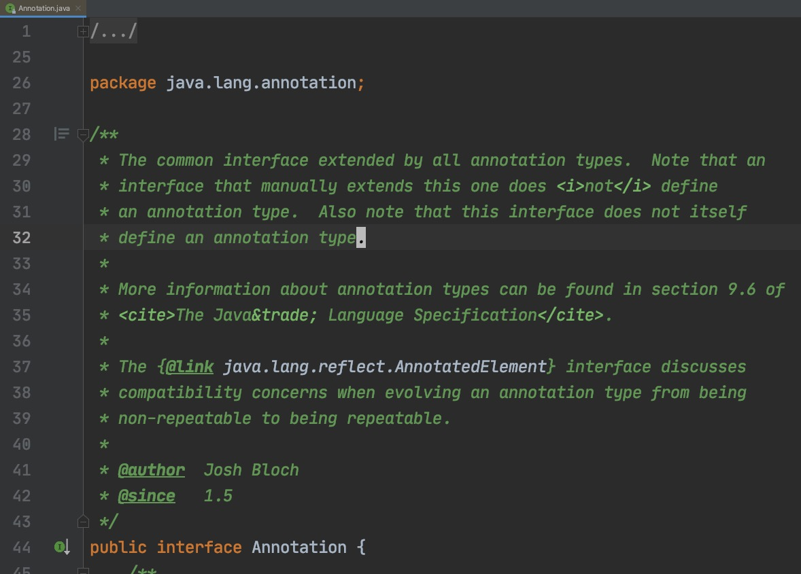
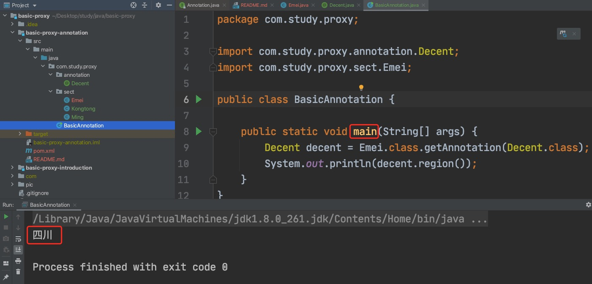

# 动态代理在注解(`Annotation`)中的应用

## 参考文章
1. [(掘金) JAVA 注解的基本原理](https://juejin.cn/post/6844903636733001741)

## 正文
[前文](../README.md) 讨论了动态代理的一个小例子。
其实动态代理的应用场景还是有很多的，例如注解中的一些功能就是借助动态代理实现的。

本文会简单讨论动态代理在注解中的使用。

### java.lang.annotation.Annotation
在 `java.lang.annotation.Annotation` 类的 `javadoc` 中可以看到这样的描述
> The common interface extended by all annotation types.  Note that an
> interface that manually extends this one does <i>not</i> define
> an annotation type.  Also note that this interface does not itself
> define an annotation type.



大致就是说所有的注解都是 `Annotation` 的子类，
但是如果直接手写一个 `Annotation` 的子类，
那么这样的类并不会被当作注解。

### 动手写注解
参考 [倚天屠龙记](https://zh.wikipedia.org/zh/%E5%80%9A%E5%A4%A9%E5%B1%A0%E9%BE%99%E8%AE%B0) 中的设定，
江湖上有些门派以名门正派自居，而明教则常被这些名门正派视为异类。
我们可以把 *名门正派* 看成一种标签，可以用注解模拟这种打标签的逻辑。
我们就定一个一个名为 `@Decent` 的注解来描述这种标签吧。
其完整代码在 [Decent.java](src/main/java/com/study/proxy/annotation/Decent.java) 中。
这个类的主要代码如下
```java
/**
 * 用于描述名门正派的相关信息的注解
 */
@Retention(RetentionPolicy.RUNTIME)
public @interface Decent {
    /**
     * 是个名门正派吗?
     *
     * @return 是则返回 true, 否则返回 false (默认值是 true)
     */
    boolean yes() default true;

    /**
     * 活跃地区
     *
     * @return 活跃地区(默认值是 中华)
     */
    String region() default "中华";
}
```

我们定义三个类，给它们都加上 `@Decent` 注解
1. 峨眉派: [Emei.java](src/main/java/com/study/proxy/sect/Emei.java)
2. 崆峒派: [Kongtong.java](src/main/java/com/study/proxy/sect/Kongtong.java)
3. 明教: [Ming.java](src/main/java/com/study/proxy/sect/Ming.java)

以 `Emei.java` 为例，其主要代码如下
```java
@Decent(region = "四川")
public class Emei {
}
```

我们再写一个简单的 `BasicAnnotation` 类，其主要代码如下(`BasicAnnotation.java` 的完整代码在 [BasicAnnotation.java](src/main/java/com/study/proxy/BasicAnnotation.java) 中)
```java
public class BasicAnnotation {

    public static void main(String[] args) {
        Decent decent = Emei.class.getAnnotation(Decent.class);
        System.out.println(decent.region());
    }
}
```

不出意外的话，`BasicAnnotation` 类中的 `main` 方法运行完之后，会有 "四川" 展示出来

 

