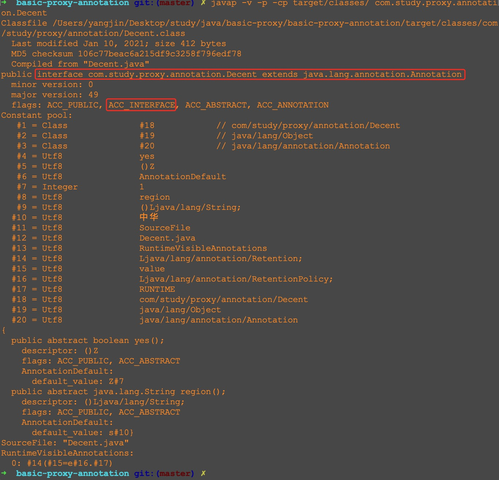
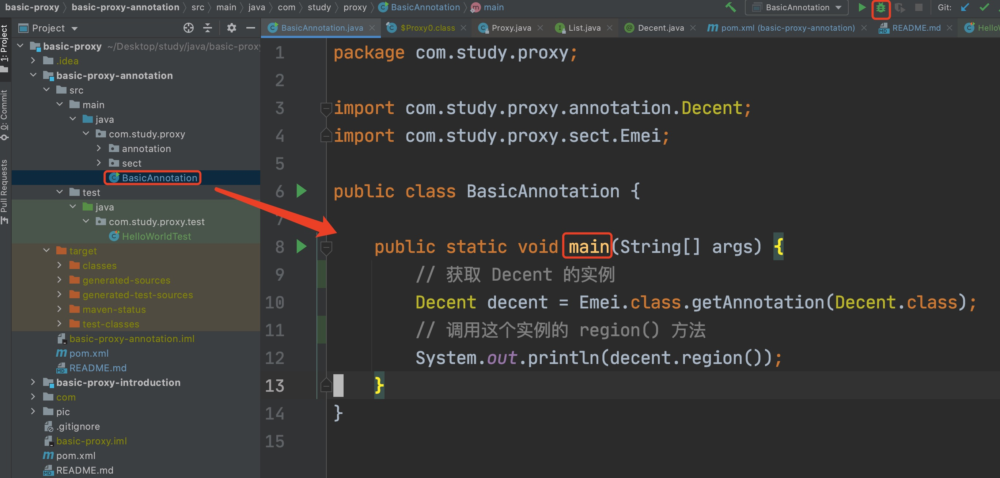
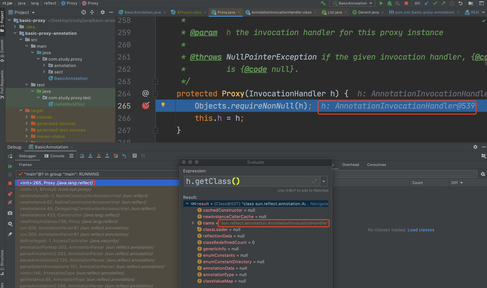
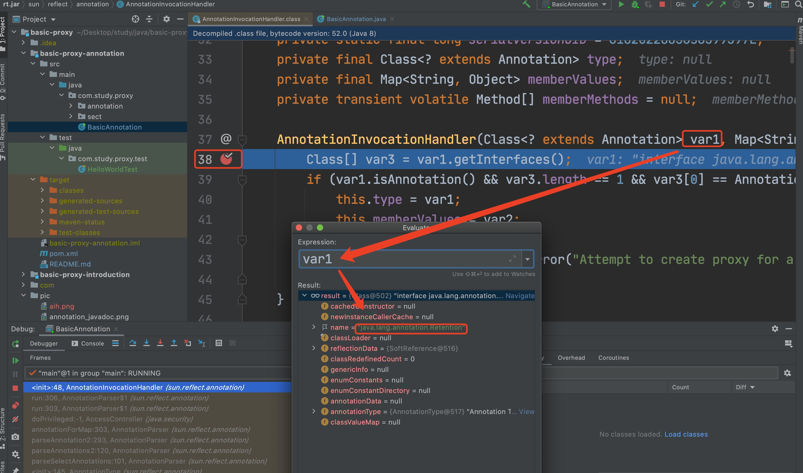
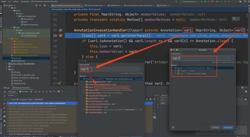

# 动态代理在注解(`annotation`)中的应用

## 参考文章
1. [(掘金) JAVA 注解的基本原理](https://juejin.cn/post/6844903636733001741)
2. [Java Language Specification 中的 9.6. Annotation Types](https://docs.oracle.com/javase/specs/jls/se15/html/jls-9.html#jls-9.6)

## 主要结论
1. 注解(`annotation`)是一种特殊的接口(`interface`)
2. 注解中可以定义方法

## 正文
[前文](../README.md) 讨论了动态代理的一个小例子。
其实动态代理的应用场景还是有很多的，例如注解中的一些功能就是借助动态代理实现的。

本文会简单讨论动态代理在注解中的使用。

### 注解是一种特殊的接口
在 `java.lang.annotation.Annotation` 类的 `javadoc` 中可以看到这样的描述
> The common interface extended by all annotation types.  Note that an
> interface that manually extends this one does <i>not</i> define
> an annotation type.  Also note that this interface does not itself
> define an annotation type.


大致就是说所有的注解都是 `java.lang.annotation.Annotation` 的子类，
但是如果直接手写一个 `java.lang.annotation.Annotation` 的子类，
那么这样的子类并不会被当作注解。

[Java Language Specification 中的 9.6. Annotation Types](https://docs.oracle.com/javase/specs/jls/se15/html/jls-9.html#jls-9.6) 提到
> An annotation type declaration specifies a new annotation type, a special kind of interface type.

可见注解也是接口(`interface`)。
不过注解和普通的接口还是有明显不同的。
按照我的理解，注解和普通接口的关系就像一些小说里主角和配角的关系。
在这些小说里，配角遇到倒霉事多半只能认栽，而主角则时常有好运伴随，总能逢凶化吉。
普通接口并不能用来修饰其他元素，而注解就可以(是不是也可以看作一种主角光环呢?)。

例如在 [juni4](https://junit.org/junit4/) 中，我们可以用 `@Test` 注解来修饰需要测试的方法。
我在 [HelloWorldTest.java](src/test/java/com/study/proxy/test/HelloWorldTest.java) 中写了如下代码
```java
package com.study.proxy.test;

import org.junit.Test;

public class HelloWorldTest {

    @Test
    public void testHelloWorld() {
        System.out.println("Hello world");
    }
}
```

在这段代码里，`testHelloWorld()` 方法是被 `@Test` 注解修饰的。
但是我们不能用普通的接口(例如 `java.util.List`)来修饰 `testHelloWorld()` 方法

关于注解也是一种接口，还可以多解释一些(没兴趣的读者可以略过这一段)。
下一小节会有一个注解 [Decent.java](src/main/java/com/study/proxy/annotation/Decent.java) 出现，这里我们先征用一下。
在当前目录下执行如下命令
```bash
mvn clean compile
```
然后利用 `javap` 命令查看 [Decent.java](src/main/java/com/study/proxy/annotation/Decent.java) 对应的字节码的结构。
具体的命令如下
```bash
javap -v -p -cp target/classes/ com.study.proxy.annotation.Decent
``` 

在红框部分可以看到，`Decent` 确实是一个 `interface`(字节码文件的结构又是一个比较大的话题，作者的相关知识也比较有限，这里就不展开了)。

### 动手写注解
参考 [倚天屠龙记](https://zh.wikipedia.org/zh/%E5%80%9A%E5%A4%A9%E5%B1%A0%E9%BE%99%E8%AE%B0) 中的设定，
江湖上有些门派以名门正派自居，而明教则常被这些名门正派视为异类。
我们可以把 *名门正派* 看成一种标签，可以用注解模拟这种打标签的逻辑。
我们就写一个名为 `@Decent` 的注解来描述这种标签吧。
其完整代码在 [Decent.java](src/main/java/com/study/proxy/annotation/Decent.java) 中。
这个类的主要代码如下
```java
/**
 * 用于描述名门正派的相关信息的注解
 */
@Retention(RetentionPolicy.RUNTIME)
public @interface Decent {
    /**
     * 是个名门正派吗?
     *
     * @return 是则返回 true, 否则返回 false (默认值是 true)
     */
    boolean yes() default true;

    /**
     * 活跃地区
     *
     * @return 活跃地区(默认值是 中华)
     */
    String region() default "中华";
}
```

我们定义三个类，给它们都加上 `@Decent` 注解
1. 峨眉派: [Emei.java](src/main/java/com/study/proxy/sect/Emei.java)
2. 崆峒派: [Kongtong.java](src/main/java/com/study/proxy/sect/Kongtong.java)
3. 明教: [Ming.java](src/main/java/com/study/proxy/sect/Ming.java)

以 `Emei.java` 为例，其主要代码如下
```java
@Decent(region = "四川")
public class Emei {
}
```

我们再写一个简单的 `BasicAnnotation` 类，其主要代码如下(`BasicAnnotation.java` 的完整代码在 [BasicAnnotation.java](src/main/java/com/study/proxy/BasicAnnotation.java) 中)
```java
public class BasicAnnotation {

    public static void main(String[] args) {
        // 获取 Decent 的实例 
        Decent decent = Emei.class.getAnnotation(Decent.class);
        // 调用这个实例的 region() 方法
        System.out.println(decent.region());
    }
}
```

### 注解是如何被动态代理支持的?
不出意外的话，`BasicAnnotation` 类中的 `main` 方法运行完之后，会有 "四川" 展示出来


上述代码中主要做了两件事
1. 获取 `Decent` 的实例 
2. 调用这个实例的 `region()` 方法 
 
既然注解本质上也是接口，那么这里就有个问题，`Decent` 中定义的 `region()` 方法是谁实现的呢?
比如我们在某些代码里调用 `java.util.List` 中的 `get(int)` 方法时，总归需要有某个子类来实现这个方法。
现在的问题也是类似的。
如果这里涉及动态代理的话，那么照理说应该会用到 `java.lang.reflect.Proxy` 这个类(相关内容可以参考 [前文](../README.md))。
我们在 `java.lang.reflect.Proxy` 中加个断点

然后 `debug` `BasicAnnotation` 类的 `main` 方法
 
这时候会遇到刚才的断点。
我们在这了观察一下，会发现 `h` 的类型是 `sun.reflect.annotation.AnnotationInvocationHandler`

那我们再到 `sun.reflect.annotation.AnnotationInvocationHandler` 这个类中观察一下。
我在 38 行打了个断点，然后重新 `debug` 一次。
第一次到 38 行这个断点时，是和 `@Rentention` 注解有关。

这次放过。
第二次来到这个断点时，我观察了一下，结果如下


运行到 41 行的时候
```java
this.memberValues = var2;
```
