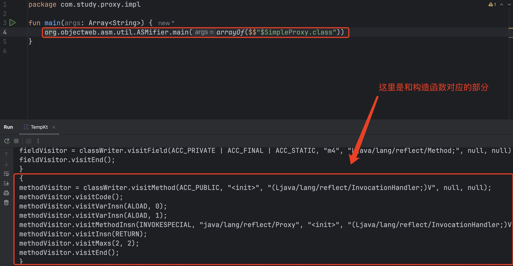
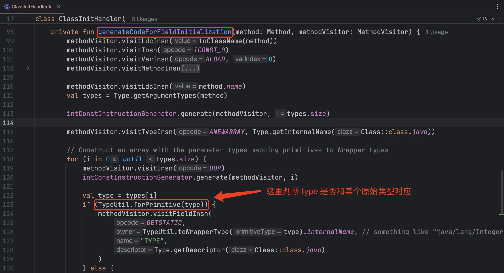

# 用 `ASM` 来生成动态代理类的 `byte[]`

## 1. 背景

本模块的作用和 [basic-proxy-impl](../basic-proxy-impl) 一样，都是用 `ASM` 来生成动态代理类的 `byte[]`。
与 [basic-proxy-impl](../basic-proxy-impl) 不同的是，本模块是用 `kotlin` 实现的。

本文和 [basic-proxy-impl 里的 README.md](../basic-proxy-impl/README.md) 的内容大同小异。

因为我之前看过一些 `ASM` 的介绍，
而且对 **动态代理** 的基本知识也有一些了解，
所以就想把这两个知识点结合起来，做点事情。

最初的目标是实现和 `java.lang.reflect.Proxy.newProxyInstance(...)` 完全一样的功能，但至少会有以下 `4` 个问题

1. `Proxy.newProxyInstance(...)` 方法的第 `1` 个参数是 `java.lang.ClassLoader`，用于指定类加载器，但类加载器的逻辑和动态代理类的生成并没有直接的关系
2. `Proxy.newProxyInstance(...)` 方法的第 `2` 个参数是 `java.lang.Class<?>[]`，这个参数是接口的数组，我们需要对接口中的方法进行去重和冲突检测
3. 生成的代理类的 `fully qualified name` 是什么，它应该在哪个 `package` 中？
4. 观察调用 `java.lang.reflect.Proxy.newProxyInstance(...)` 时所生成的 `class` 文件，会发现其中有 `proxyClassLookup(...)`
   方法，我不知道这个方法有什么作用，但是看起来该方法对动态代理的功能没有影响

感觉有点复杂，所以我把目标降低一些，变成这样 ⬇️

1. 用户指定 **一个** `interface`，我们只生成这个 `interface` 对应的动态代理类的 `byte[]`。
2. 代理类的 `fully qualified name` 暂定为 `com.study.proxy.impl.$SimpleProxy`（对应的 `package` 是
   `com.study.proxy.impl`）。
3. 既然暂时不清楚 `proxyClassLookup(...)` 方法的作用，那就先忽略这个方法吧。

这样上面的 `4` 个问题都可以规避/解决。

## 2. 整体思路

在 [basic-proxy](../README.md) 一文中，我们已经研究过了动态代理的基本知识。
基于这些知识，我们可以有一个整体的思路。
我们需要在动态代理类中生成 字段/构造函数/其他方法，要点如下 ⬇️

### 2.1 关于字段

如果这个 `interface` 中定义了 `n` 个方法（例如 `java.lang.Runnable` 中只定义了 `run()` 方法，则 `n = 1`）

1. 需要生成以下 3+n 个 `java.lang.reflect.Method` 类型的字段
    * `3` 个字段分别和 `java.lang.Object` 中的 `equals(java.lang.Object)`/`hashCode()`/`toString()` 方法对应
    * `n` 个字段分别和这个 `interface` 中定义的 `n` 个方法对应
2. 在动态代理类进行初始化的时候（即，在 `static` 语句块中），对这 3+n 个 `java.lang.reflect.Method` 类型的字段赋值

### 2.2 关于动态代理类的构造函数
如 [basic-proxy](../README.md) 中所提到的，
在 [\$Proxy0.java](../\$Proxy0.java) 中可以看到是一个动态代理类具体是什么样子的。
[\$Proxy0.java](../\$Proxy0.java) 中构造函数如下 ⬇️

```java
public $Proxy0(InvocationHandler var1) {
    super(var1);
}
```

我们自己生成的动态代理类的构造函数的逻辑应与此类似。
即，

* 构造函数仅有 `1` 个 `InvocationHandler` 类型的入参
* 在这个构造函数中，只调用父类的构造函数，没有其他逻辑。

### 2.3 关于其他方法

动态代理类中，要生成 3+n 个方法，即 ⬇️

* `equals(java.lang.Object)` 方法
* `hashCode()` 方法
* `toString()` 方法
* 这个 `interface` 中定义的 `n` 个方法

这些方法的逻辑都是类似的，
例如 [`$Proxy0.java`](../$Proxy0.java) 中的 `equals(java.lang.Object)` 是这样的 ⬇️

```java
public final boolean equals(Object var1) {
    try {
        return (Boolean) super.h.invoke(this, m1, new Object[]{var1});
    } catch (RuntimeException | Error var2) {
        throw var2;
    } catch (Throwable var3) {
        throw new UndeclaredThrowableException(var3);
    }
}
```

## 3 辅助手段

照理说，我们可以自己手动调用 `ASM` 库中的相关方法，
来生成对应的 `byte[]`，
但由于生成代理类会涉及不少细节和特殊情况，
加之 `ASM` 提供的方法偏底层，
如果完全靠自己手写的话，还是比较容易走弯路的。
这里提供以下两个辅助手段（我自己在完成 `basic-proxy-impl` 的过程中，也用了这两个辅助手段）。

### 3.1 辅助手段 1

利用 `ASMifier` 来生成代码。
通过如下方式可以查看应该如何调用 `ASM` 的相关 `api` 来生成对应的 `byte[]`。

```kotlin
org.objectweb.asm.util.ASMifier.main(arrayOf($$"$SimpleProxy.class"))
```

示例效果如下图 ⬇️



基于 `ASMifier` 提供的代码，再进行调整，这就容易多了。

### 3.2 辅助手段 2

既然我们是要实现与 `Proxy.newProxyInstance(...)` 类似的功能，那就先看看它自己是怎么做到的。
在 `java.lang.reflect.Proxy` 类的 `newProxyInstance(...)` 方法中，
经过若干次函数调用，会访问 `java.lang.reflect.ProxyGenerator` 中的 `generateClassFile()` 方法，
生成 `byte[]` 的逻辑就在这个方法中，
所以当我们遇到不确定的逻辑时，
可以去 `generateClassFile()` 这个方法里查看对应的地方是如何实现的（而不要自己乱猜）。

## 4. 实现细节

### 4.1 关于字段

#### 4.1.1 定义 3+n 个字段

从 `java` 源码的角度来理解，就是在动态代理类中生成如下的字段定义（一共有 3+n 个字段，如果指定的 `interface` 是
`java.lang.Runnable` 的话，则 `n = 1`）

```java
// 注意：一共有 3+n 个字段，这里是 n=1 的情况
private static final Method m0;
private static final Method m1;
private static final Method m2;
private static final Method m3;
```

字段的定义比较直观，但我们还是可以借助 `ASMifier` 的帮助。
对应的代码，我写在 [
`com.study.proxy.impl.handler.FieldHandler` 类](/src/main/kotlin/com/study/proxy/impl/handler/FieldHandler.kt) 的
`process()` 方法里了。
`process()` 方法的代码展示如下 ⬇️

```kotlin
/**
 * A sample field:
 * <code>private static final java.lang.reflect.Method m0</code>
 */
override fun process() {
   for (i in 0 until methods.size) {
      val fieldVisitor = classWriter.visitField(
         accessFlags,
         "m${i}",
         descriptor,
         null,
         null
      )
      fieldVisitor.visitEnd()
   }
}
```

#### 4.1.2 为 3+n 个字段赋值

从 `java` 源码的角度来理解，就是要生成类似这样的 `static` 语句块 ⬇️

```java
static {
    // 注意：需要将 $Proxy0 替换成我们生成的动态代理类
    ClassLoader var0 = $Proxy0.class.getClassLoader();

    try {
        m0 = Class.forName("java.lang.Object", false, var0).getMethod("hashCode");
        m1 = Class.forName("java.lang.Object", false, var0).getMethod("equals", Class.forName("java.lang.Object", false, var0));
        m2 = Class.forName("java.lang.Object", false, var0).getMethod("toString");
        m3 = Class.forName("java.lang.Runnable", false, var0).getMethod("run");
    } catch (NoSuchMethodException var2) {
        throw new NoSuchMethodError(((Throwable) var2).getMessage());
    } catch (ClassNotFoundException var3) {
        throw new NoClassDefFoundError(((Throwable) var3).getMessage());
    }
}
```

这个 `static` 语句块的逻辑分成几部分

1. 通过动态代理类自身的 `class` 对象获取对应的类加载器，保存在 `var0` 变量中
2. 对 `m0`/`m1`/`m2` 分别赋值
    * 通过 `java.lang.Class.forName(java.lang.String, boolean, java.lang.ClassLoader)` 找到对应的 `class` 对象
        * 第 `1` 个参数总是 `"java.lang.Object"`
        * 第 `2` 个参数总是 `false`
        * 第 `3` 个参数总是 `var0`
    * 调用 `class` 对象上的 `getMethod(String name, Class<?>... parameterTypes)` 方法
        * `name` 参数是方法名
        * `parameterTypes` 参数和那个方法的各个入参的类型对应
3. 对剩余的 `n` 个字段赋值
    * 通过 `java.lang.Class.forName(java.lang.String, boolean, java.lang.ClassLoader)` 找到对应的 `class` 对象
        * 第 `1` 个参数总是指定的 `interface` 的 `fully qualified name`
        * 第 `2` 个参数总是 `false`
        * 第 `3` 个参数总是 `var0`
    * 调用 `class` 对象上的 `getMethod(String name, Class<?>... parameterTypes)` 方法
        * `name` 参数是方法名
        * `parameterTypes` 参数和那个方法的各个入参的类型对应
4. 把字段赋值的逻辑用 `try-catch` 语句包装起来

我把 `static` 语句块的处理逻辑封装在了 [
`com.study.proxy.impl.handler.ClassInitHandler` 类](src/main/java/com/study/proxy/impl/handler/ClassInitHandler.java) 中。

大部分代码应该比较直观（但可能有点繁琐），我把主要的步骤解释一下
##### 4.1.2.1 解释
第 `1` 步用 `java` 代码表示，会是这样
```java
ClassLoader var0 = $SimpleProxy.class.getClassLoader();
```

对应的代码如下
```kotlin
// Put ClassLoader at local variable index 0, used by
// Class.forName(String, boolean, ClassLoader) calls
methodVisitor.visitLdcInsn(Type.getType(ClassNameProvider.typeDescriptor()))
methodVisitor.visitMethodInsn(
        INVOKEVIRTUAL,
        Type.getInternalName(Class::class.java),
        "getClassLoader",
        "()Ljava/lang/ClassLoader;",
        false
)
methodVisitor.visitVarInsn(ASTORE, 0)
```

第 `2` 步和第 `3` 步是类似的，可以一起处理。
处理的逻辑在 [`com.study.proxy.impl.handler.ClassInitHandler` 类](src/main/kotlin/com/study/proxy/impl/handler/ClassInitHandler.kt) 的 `generateCodeForFieldInitialization(...)` 方法里。
这里有一个特殊情况，如果我们要处理的 `interface` 是 `java.util.function.IntConsumer`，
那么对应的字符赋值会是这样 ⬇️
```java
m0 = Class.forName("java.lang.Object", false, var0).getMethod("hashCode");
m1 = Class.forName("java.lang.Object", false, var0).getMethod("equals", Class.forName("java.lang.Object", false, var0));
m2 = Class.forName("java.lang.Object", false, var0).getMethod("toString");
m3 = Class.forName("java.util.function.IntConsumer", false, var0).getMethod("accept", Integer.TYPE);
m4 = Class.forName("java.util.function.IntConsumer", false, var0).getMethod("andThen", Class.forName("java.util.function.IntConsumer", false, var0));
```
这里会发现 `m3` 比较特殊，
因为 `java.util.function.IntConsumer` 的 `accept(int)` 方法的入参的类型是基本类型 `int`，
所以是用 `java.lang.Integer.TYPE` 来表示对应的 `class`。
其实这里写成 `int.class` 应该也是可行的，
但是为了之后方便测试起见，
我们还是尽量遵守 `Proxy.newProxyInstance(...)` 的做法。
除了 `int` 类型外，
其他几个基本类型也需要对应的转化。

代码中有一个 `if` 判断会做对应的处理 ⬇️


第 `4` 步需要运用关于 [`Code` 属性](https://docs.oracle.com/javase/specs/jvms/se24/html/jvms-4.html#jvms-4.7.3) 里 `exception table` 的知识，
我觉得可以在 `ASMifier` 给出的结果的基础上进行理解。这里就不展开说了。


### 4.2 构造函数的处理

用 `javap -v -p XXX` (`XXX` is some class name) 可以查看 `Proxy.newProxyInstance(...)` 所生成的动态代理类的构造函数的
`Code` 属性。
`Code` 属性中应该恰有 `4` 条指令，具体如下 ⬇️（第 `3` 条指令 `invokespecial` 会带有参数，所以这条指令的内容不固定，`//`
之后的内容是注释）

```text
aload_0
aload_1
invokespecial #? // Method java/lang/reflect/Proxy."<init>":(Ljava/lang/reflect/InvocationHandler;)V
return
```

有了 `ASMifier` 的帮助，可以写出对应的代码。
这些代码在 [
`com.study.proxy.impl.handler.ConstructorHandler` 类](src/main/kotlin/com/study/proxy/impl/handler/ConstructorHandler.kt)
的 `process()` 方法里。

注意，如下的这行代码和 `ASMifier` 给出的代码不同。这是因为我们会统一让 `ASM` 来计算 `Code` 属性中的 `max_stack` 和
`max_locals`，所以就不必手动给它们赋值了。

```java
constructorVisitor.visitMaxs(-1,-1);
```

### 4.3 其他方法的处理
其他的 3+n 个方法的处理是类似的
我们举两个典型的例子
#### 4.3.1 例子 `1`: `hashCode()` 方法

[`$Proxy0.java`](../$Proxy0.java) 中的 `hashCode()` 方法如下
```java
    public final int hashCode() {
        try {
            return (Integer)super.h.invoke(this, m0, (Object[])null);
        } catch (RuntimeException | Error var2) {
            throw var2;
        } catch (Throwable var3) {
            throw new UndeclaredThrowableException(var3);
        }
    }
```

主要的逻辑在 `return (Integer)super.h.invoke(this, m0, (Object[])null);` 这一行。
我用 `javap` 命令查看了对应的 `Code` 属性，对应的指令如下（这里略去和 `catch` 语句块相关的部分）
```text
 0: aload_0
 1: getfield      #24                 // Field java/lang/reflect/Proxy.h:Ljava/lang/reflect/InvocationHandler;
 4: aload_0
 5: getstatic     #26                 // Field m0:Ljava/lang/reflect/Method;
 8: aconst_null
 9: invokeinterface #32,  4           // InterfaceMethod java/lang/reflect/InvocationHandler.invoke:(Ljava/lang/Object;Ljava/lang/reflect/Method;[Ljava/lang/Object;)Ljava/lang/Object;
14: checkcast     #34                 // class java/lang/Integer
17: invokevirtual #37                 // Method java/lang/Integer.intValue:()I
20: ireturn
// 后面还有一些指令，这里略去
```
如果手动转化的话，对应的 `java` 代码是这样的 ⬇️
```java
return ((Integer)super.h.invoke(this, m0, null)).intValue();
```

和 [`$Proxy0.java`](../$Proxy0.java) 里展示的代码略有区别，我们应该以 `javap` 命令展示的结果为准。
这里有两个特殊的处理
1. 如果方法中的入参个数为 `0`, 则 `super.h.invoke(...)` 里的最后一个参数会填写成 `null`
2. 如果方法返回的是基本类型，那么需要在 `cast` 成对应的包装类（`java.lang.Integer`/`java.lang.Long` 等）之后，调用对应的 `xxxValue()` 方法（例如 `intValue()`/`longValue()` 等）

多说一句，如果方法返回的是 `void`，那么就不需要 `cast` 操作了

#### 4.3.2 例子 `2`: `equals(java.lang.Object)` 方法

[`$Proxy0.java`](../$Proxy0.java) 中的 `equals(java.lang.Object)` 方法如下
```java
public final boolean equals(Object var1) {
   try {
      return (Boolean)super.h.invoke(this, m1, new Object[]{var1});
   } catch (RuntimeException | Error var2) {
      throw var2;
   } catch (Throwable var3) {
      throw new UndeclaredThrowableException(var3);
   }
}
```

主要的逻辑是 `return (Boolean)super.h.invoke(this, m1, new Object[]{var1});` 这一行。
我用 `javap` 命令查看了对应的 `Code` 属性，对应的指令如下（这里略去和 `catch` 语句块相关的部分）
```text
 0: aload_0
 1: getfield      #24                 // Field java/lang/reflect/Proxy.h:Ljava/lang/reflect/InvocationHandler;
 4: aload_0
 5: getstatic     #47                 // Field m1:Ljava/lang/reflect/Method;
 8: iconst_1
 9: anewarray     #49                 // class java/lang/Object
12: dup
13: iconst_0
14: aload_1
15: aastore
16: invokeinterface #32,  4           // InterfaceMethod java/lang/reflect/InvocationHandler.invoke:(Ljava/lang/Object;Ljava/lang/reflect/Method;[Ljava/lang/Object;)Ljava/lang/Object;
21: checkcast     #51                 // class java/lang/Boolean
24: invokevirtual #55                 // Method java/lang/Boolean.booleanValue:()Z
27: ireturn
// 后面还有一些指令，这里略去 
```

如果手动转化的话，对应的 `java` 代码是这样的 ⬇️
```java
return ((Boolean)super.h.invoke(this, m0, new Object[]{var1})).booleanValue();
```

由于 `equals(java.lang.Object)` 方法有一个参数，所以需要把它放到数组中，然后将这个数组作为 `super.h.invoke(...)` 的最后一个参数
那么如果方法中有 `n` 个参数（`n > 0`），那么需要生成一个长度为 `n`，类型是 `Object[]` 的数组来容纳这些参数。
这里有一种特殊情况，如果参数中有基本类型出现，那么需要将那些参数转化为对应的包装类。
将入参转化为 `Object[]` 的逻辑，我写在 [`com.study.proxy.impl.handler.InstanceMethodHandler` 类](src/main/kotlin/com/study/proxy/impl/handler/InstanceMethodHandler.kt) 的 `generateObjectArray(...)` 方法里了。

关于 `try-catch` 中需要 `catch` 哪些异常，需要考虑各种情况。
我把这部分的处理逻辑写在 [`com.study.proxy.impl.handler.InstanceMethodHandler` 类](src/main/kotlin/com/study/proxy/impl/handler/InstanceMethodHandler.kt) 的 `computeUniqueCatchList(...)` 方法里了。
这里还是有几种特殊情况的，我是参考了 [OpenJDK 中的 ProxyGenerator.java](https://github.com/openjdk/jdk/blob/master/src/java.base/share/classes/java/lang/reflect/ProxyGenerator.java) 里的 [computeUniqueCatchList(...)](https://github.com/openjdk/jdk/blob/master/src/java.base/share/classes/java/lang/reflect/ProxyGenerator.java#L360) 方法才完成的。

### 4.4 单元测试
由于最终生成的是一个 `byte[]`，如何验证它的正确性也是一个需要考虑的问题。
一个直接的想法是比较以下两者的内容是否完全一致
* 在 `java.lang.reflect.Proxy.newProxyInstance(...)` 的过程中生成的 `byte[]`
* [`com.study.proxy.impl.CodeGenerator` 类](src/main/kotlin/com/study/proxy/impl/CodeGenerator.kt) 中的 `generate(...)` 方法生成的 `byte[]`

但两者其实是有差异的，原因如下 ⬇️
1. 常量池中的元素没有特定的顺序
2. 在本文的 [1. 背景](#1-背景) 中提到过，本模块生成的动态代理类中，没有 `proxyClassLookup(...)` 方法

一个可行的方案是利用 `org.objectweb.asm.util.TraceClassVisitor` 来生成 `byte[]` 解析后的内容，然后再去对比解析后的内容。
具体的逻辑在 [`com.test.util.PrettyResultBuilder` 类](src/test/kotlin/com/test/util/PrettyResultBuilder.kt) 的 `build(byte[])` 方法中。
[`com.test.cases.MethodTestSuite`](src/test/kotlin/com/test/util/MethodLineMatcher.kt) 是一个测试套件，它汇总了这样的测试。
